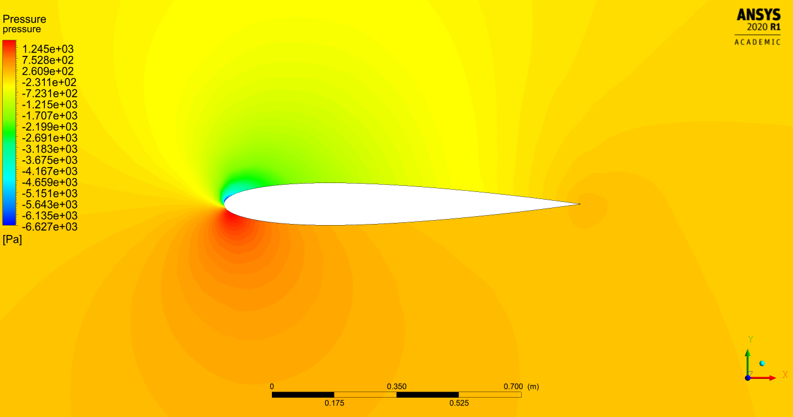
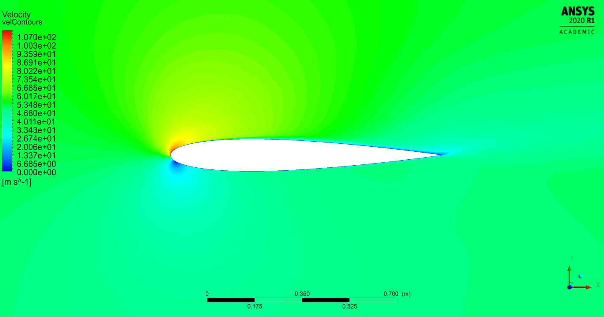
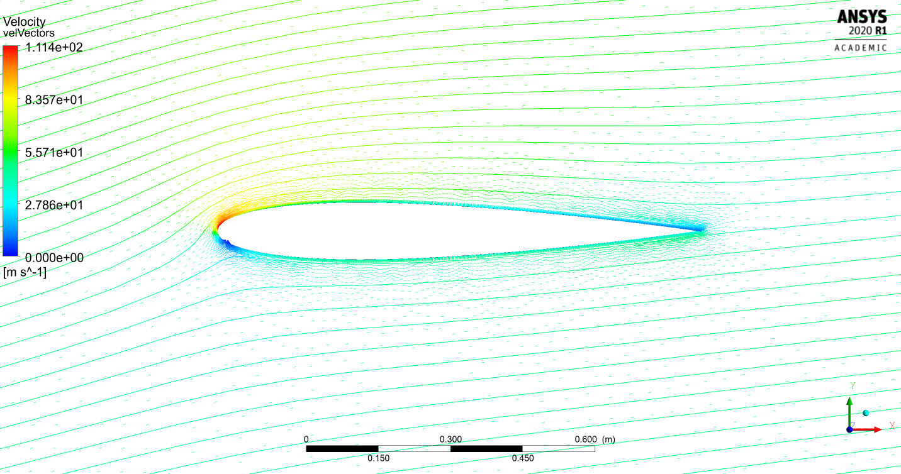

# NACA_airfoil
The following represents an aerodynamic analysis of a NACA12 airfoil using ANSYS's fluid flow module (Fluent). A pressure-based turbulence model is employed (K-Omega SST).
The fluid medium is air and the airfoil itself is modeled as aluminum. From an initial and boundary conditions perspective, an input velocity is fed on one end and a pressure outlet is set on the other.
The remaining edges are prescribed with a no-slip stationary wall condition. 

#### Mesh

### Pressure Contour

### Velocity Contour

### Velocity Streamlines

## Built With

* [WorkBench 2020 R1](https://www.ansys.com/products/platform) - CAE simulation framework used
* [Ansys Fluent](https://www.ansys.com/products/fluids/ansys-fluent) - Fluid Flow CFD software
* [CFD-Post](https://www.ozeninc.com/products/fluid-dynamics/ansys-cfd-post/) - Results post-processor

## License

This project is licensed under the MIT License - see the [LICENSE.md](LICENSE.md) file for details
